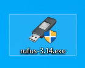
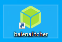
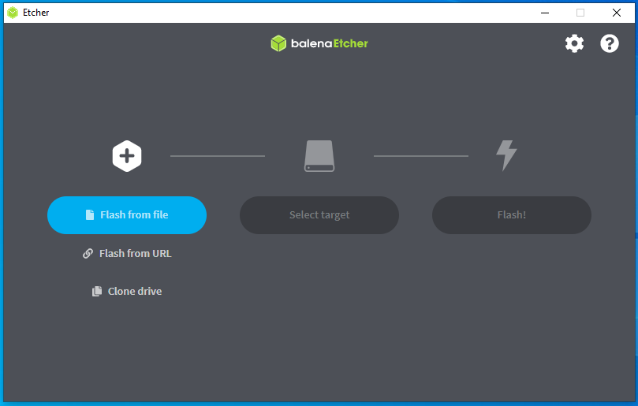
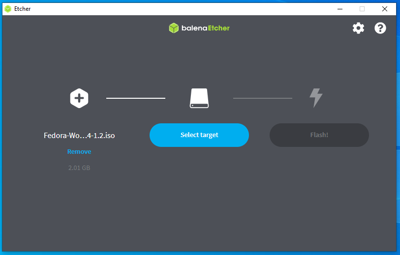
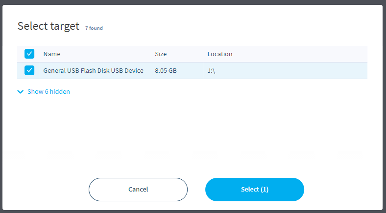
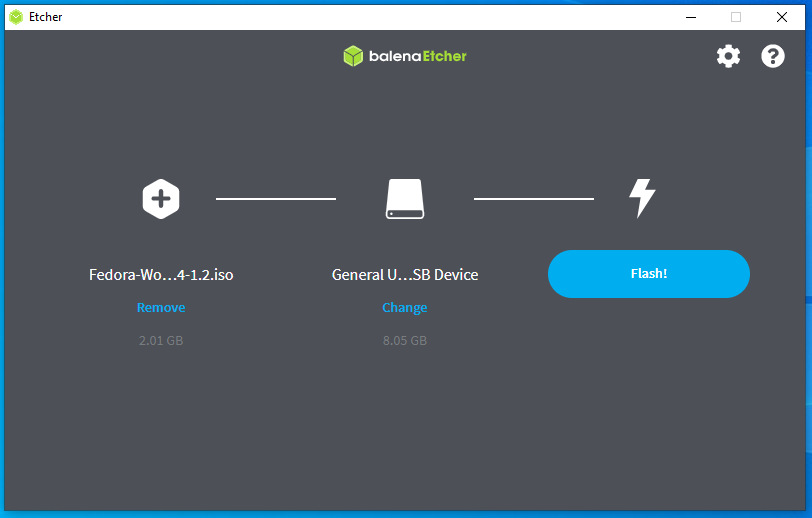
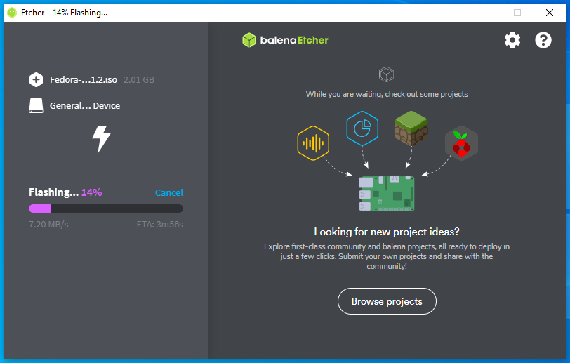
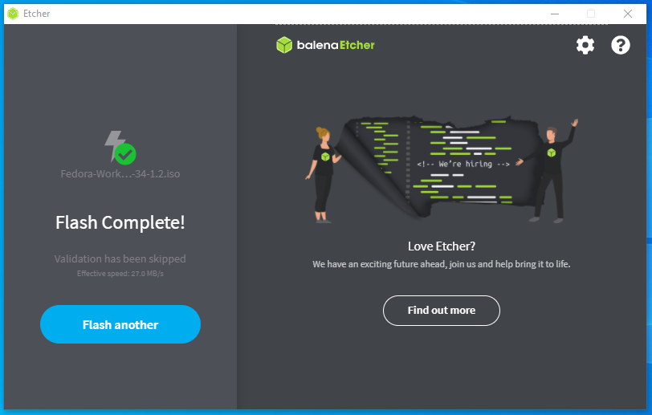

# 1.3 Tworzenie bootowalnego pendrive z obrazem ISO

Aby zainstalować wybraną przez Ciebie dystrybucję Linuksa, po pobraniu obrazu ISO z systemem powinieneś przygotować pendrive z obrazem instalacyjnym systemu. W tym celu wykonaj następujące kroki w zależności od posiadanego programu.

**Upewnij się, że pendrive nie zawiera ważnych danych – zostanie całkowicie sformatowany.**

### Rufus (Windows)
- Pobierz i uruchom [**Rufus**](https://rufus.ie).<br/>


- Włóż pendrive do komputera.

- W oknie programu:
    - Wybierz swój pendrive w polu **Urządzenie** (1)
    - W polu **Obraz dysku/ISO** kliknij **Wybierz** (2) i wskaż pobrany plik ISO
    - **Schemat partycjonowania**: dla UEFI – wybierz **GPT**
    - **System plików**: **FAT32**
- Kliknij **Start** (3) i potwierdź sformatowanie pendrive’a.<br/>

- Po zakończeniu procesu pendrive jest bootowalny.

### Etcher (Windows/Linux/MacOS)
- Pobierz [**Etcher**](https://etcher.io) (w dystrybucjach Linuksa może być dostępne w repozytorium)
- Włóż pendrive do komputera
- Uruchom Etcher<br/>
<br/>
- Wskaż plik ISO przyciskiem **Flash from file**<br/>
<br/>
- Wskaż pendrive przyciskiem **Select target**<br/>
<br/>

<br/>

- Kliknij na przycisk **Flash!** i poczekaj na zakończene procesu.<br/>

<br/>
<br/>
<br/>

### dd (zaawansowani użytkownicy Linux)
Upewnij się, że wskazujesz poprawne urządzenie (np. `/dev/sdX`), aby nie nadpisać danych!

```
sudo dd bs=4M if=~/Pobrane/twoj_obraz_instalacyjny.iso of=/dev/sdX status=progress oflag=sync
```
