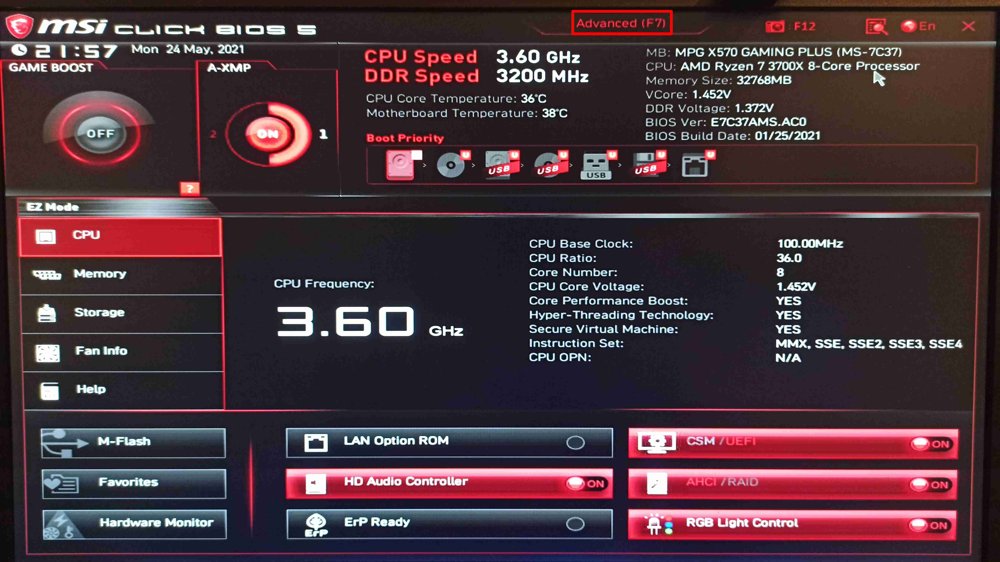
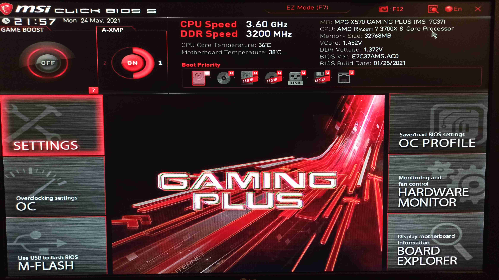
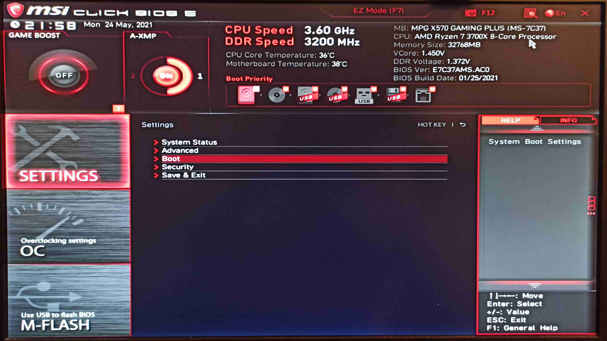
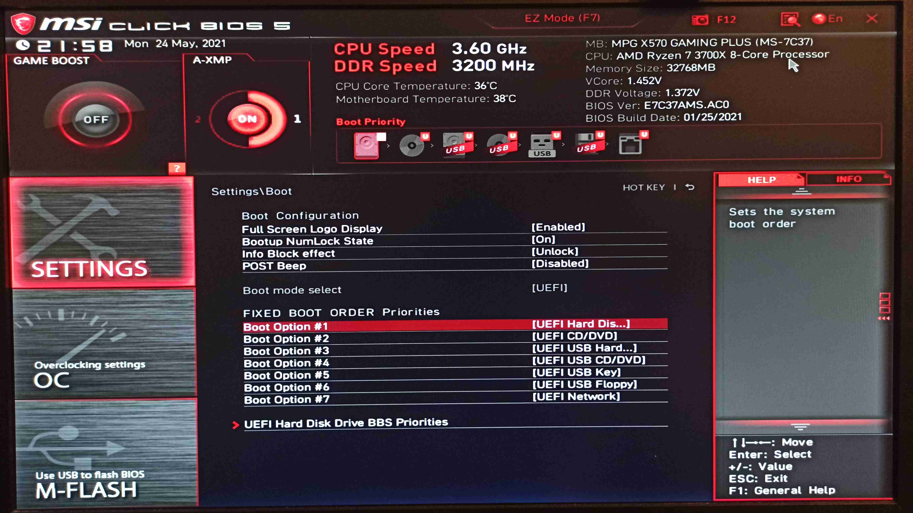
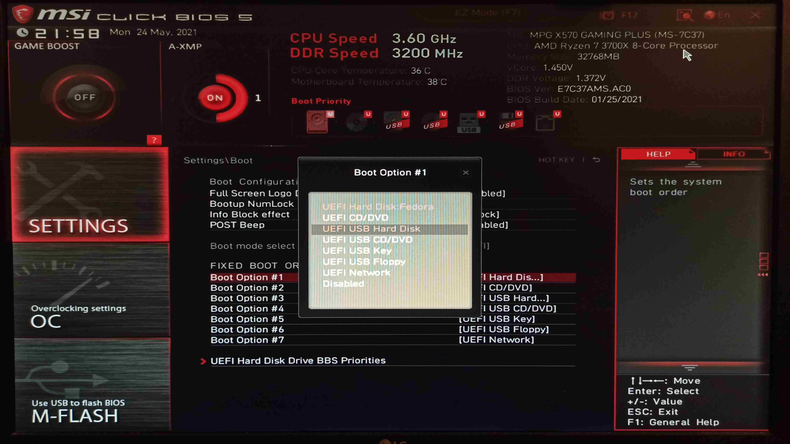
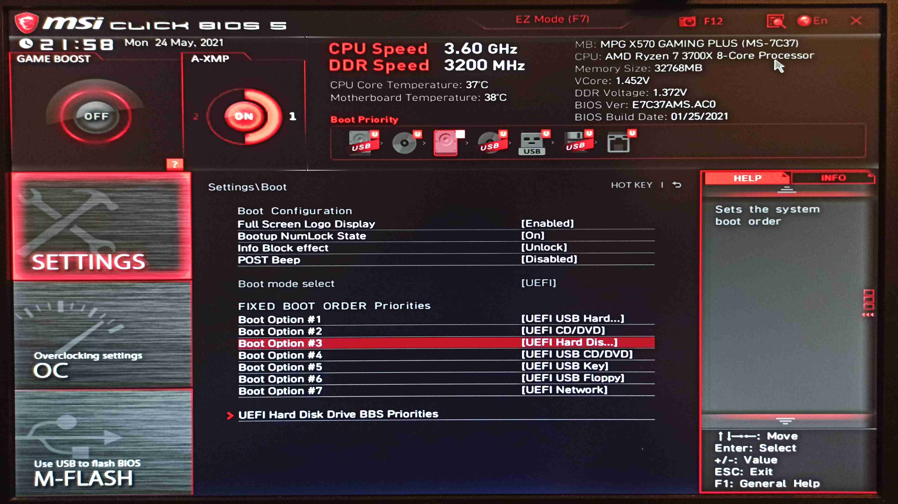
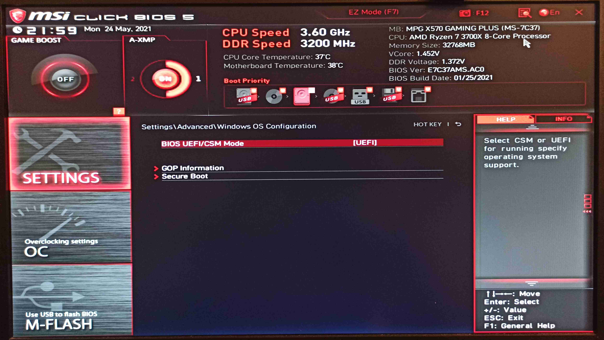
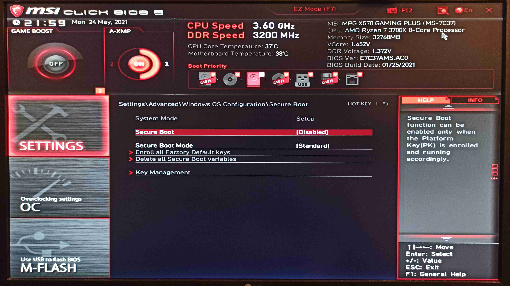

# 1.4 Konfiguracja BIOS/UEFI przed instalacją dystrybucji Linux

Zanim rozpoczniesz instalację dystrybucji Linux, warto poprawnie skonfigurować ustawienia BIOS/UEFI. Dzięki temu unikniesz problemów z bootowaniem, wykrywaniem dysków czy instalacją sterowników.

***
**Uwaga!**

**Producenci płyt głównych oraz laptopów stosują różne układy menu.**

**Przedstawione poniżej zdjęcia są poglądowe i mogą być inne w zależności od sprzętu.**

**W przypadku problemu ze zlokalizowaniem odpowiednich opcji poproś osobę doświadczoną o pomoc.**

**Poniżej zostaną wypisane wszystkie możliwe, alternatywne nazwy opcji, które można spotkać w oprogramowaniu układowym.**
***

## Jak wejść do BIOS/UEFI?
- uruchom lub zrestartuj komputer
- podczas uruchamiania **naciśnij odpowiedni klawisz** - zwykle jest to jeden z poniższych:
    - `DEL` lub `Delete`
    - `F2` lub `Fn + F2`
    - `F1` lub `Fn + F1`
    - `F10` lub `Fn + F10`
    - `F12` lub `Fn + F12`
    - `ESC`
- często pojawia się również komunikat na ekranie, który podpowiada jakiego przycisku uzyć, na przykład: **Press DEL to enter setup**.

## Najważniejsze ustawienia BIOS/UEFI

### Tryb bootowania (UEFI oraz Legacy)
- Zalecane ustawienie dla większości komputerów - **UEFI**
- Jeśli masz wyjątkowo stary sprzęt - użyj trybu **Legacy/CSM**
- Jak znaleźć? Szukaj opcji typu:
    - `Boot Mode: UEFI`
    - `UEFI/Legacy Boot: UEFI Only`

### Secure Boot
**Secure Boot** to funkcja zabezpieczająca uruchamianie tylko podpisanego systemu operacyjnego. W praktyce może powodować problemy z instalacją lub uruchamianiem niektórych dystrybucji Linux. Znajdź opcję `Secure Boot` i ustaw ją na **Disabled**.

### SATA Mode
**SATA Mode** ustawione jako "RAID" lub "RST with Optane" lub "RST without Optane" - może powodować problemy z instalacją - najczęściej dotyczy to braku sterownika kontrolera RAID (bardzo rzadko) lub technologii Intel Rapid Storage Technology (dość często spotykane w nowszych laptopach lub płytach głównych z wykorzystaniem dysku NVMe od Intela).

### Fast Boot
**Fast Boot** może pomijać ważne etapy inicjalizacji sprzętu, przez co zdarza się, iż uniemożliwia bootowanie z USB. Znajdź opcję `Fast Boot` i ustaw na **Disabled**.

### Quiet Boot
**Quiet Boot** daje podobny objaw do **Fast Boot**, najczęściej pomija sekwencję bootowania z innych nośników, dodatkowo nie wyświetlając komunikatów na ekranie.

### Kolejność bootowania (Boot Order)
- Ustaw swój pendrive (np. `UEFI: Kingston USB`) jako **pierwsze urządzenie** w kolejności bootowania
- Możesz także użyć menu bootowania (Boot Menu) (najczęściej `F12` lub `ESC` w trakcie startu), by ręcznie wybrać urządzenie

## Przykładowa konfiguracja BIOS/UEFI na płycie głównej od MSI MPG X570 Gaming Plus

### Sekwencja bootowania
- Po uruchomieniu oprogramowania układowego pierwszy raz najprawdopodobniej będziesz musiał wejść do opcji zaawansowanych (Advanced). Poszukaj takowej opcji i kliknij lub wciśnij przypisany klawisz. 
 
- Znajdź w menu opcję, która jest odpowiedzialna za ustawienia (na przykład Settings). Czasami ustawienia są dostępne od razu - zależy to od producenta płyty głównej oraz układu menu. 
 
- Znajdź opcję odpowiedzialną za ustawienie sekwencji bootowania nośników (przykładowe nazwy: "Boot", "Boot Sequence", "Boot Priority")
 
- Wybierz pierwszą opcję z listy (tu nazwana "Boot Option #1") 
 
- Wybierz nośnik, który ma być ustawiony jako pierwszy - jako że interesuje Cię pendrive to wybierz opcję z "USB" w nazwie. Jeśli nie jest to menu wybieralne wtedy najprawdopodobniej musisz użyć klawiszy na klawiaturze - najczęściej spotykanymi są: ``Page Up`` i ``Page Down`` lub ``+`` i ``-`` lub ``F5`` i ``F6``. 
 
- Jeśli sekwencja jest prawidłowa można zapisać zmiany.

### Secure Boot

- Wejdź do UEFI, w ustawienia i poszukaj opcji powiązanych z konfiguracją UEFI/CSM lub Windows OS Configuration (nazewnictwo może się różnić w zależności od płyty głównej).

- Po odnalezieniu opcji "Secure Boot" wyłącz ją (ustawienie "Disabled").

- Zapisz zmiany.