# 1.5 Instalacja dystrybucji Linux na przykładzie CachyOS

Po poprawnym przygotowaniu pendrive’a oraz skonfigurowaniu BIOS/UEFI możesz przystąpić do właściwej instalacji systemu.

Instalacja dystrybucji Linux w większości przypadków posiada podobny schemat procesu. W tym rozdziale jako przykład posłuży instalator CachyOS.

## Krok 1: Uruchomienie środowiska Live z pendrive’a

1. Włóż przygotowany pendrive do komputera. 
2. Uruchom komputer i wybierz pendrive jako urządzenie bootujące (najczęściej przyciskami `F12`, `ESC` lub odpowiednim ustawieniem w UEFI/BIOS). 
3. Na ekranie bootowania wybierz:
   - `CachyOS` - jeśli masz nowy sprzęt,
   - `CachyOS Legacy Hardware (GPU nomodeset)` - w przypadku posiadania starszej karty graficznej. 

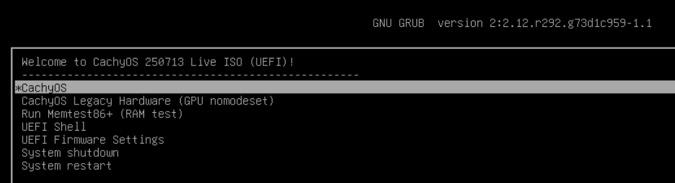 

4. Po kilku chwilach uruchomi się **środowisko Live** oparte na KDE Plasma. 

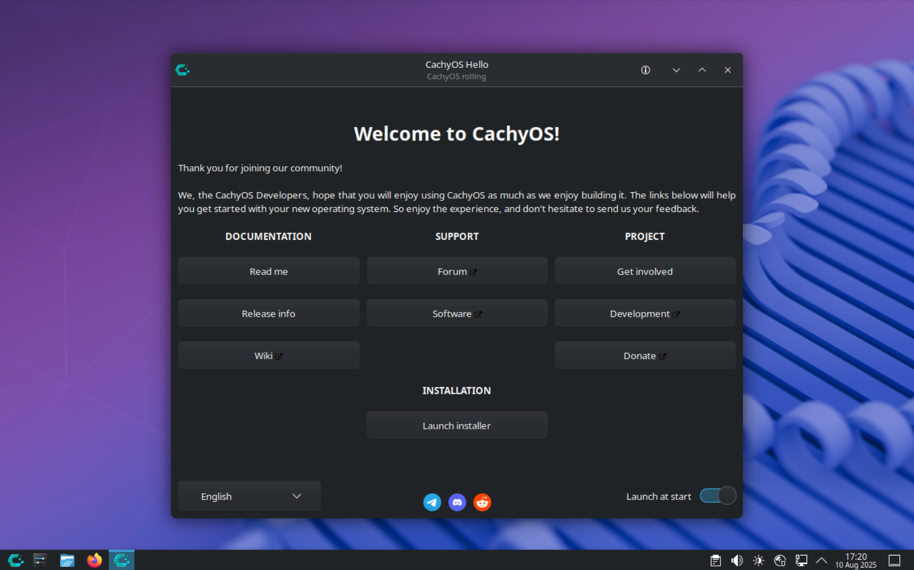 

## Krok 2: Rozpoczęcie instalacji

Z okna CachyOS Hello wybierz opcję **Launch installer**.
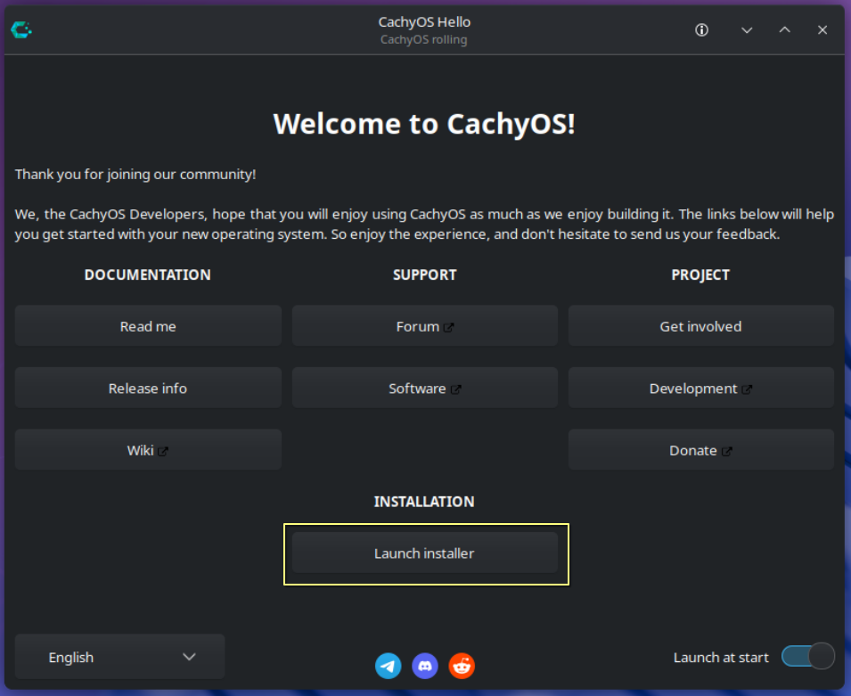

(**ten krok dotyczy tylko CachyOS**)
W nowym oknie zostaniesz poproszony o wybór bootloadera.
Jeśli jesteś początkujący - wybierz **Grub**.
Jeśli nie jest to Twój pierwszy kontakt z Linuksem - wybierz **systemd-boot (default)**.
Pozostałe dostępne opcje można użyć wedle uznania, ale dwie pierwsze są najpopularniejsze.

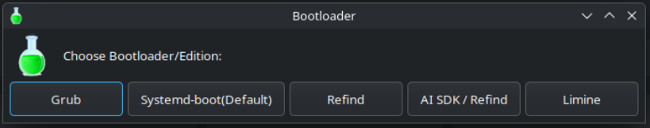

Po chwili rozpocznie się właściwa instalacja systemu CachyOS.

## Krok 3: Wybór języka instalatora
W pierwszym etapie instalacji wybierz język z rozwijanej listy. Powinien automatycznie wybrać się **"polski"**. Jeśli tak się nie stało lub chcesz wybrać inny język - popraw to teraz.
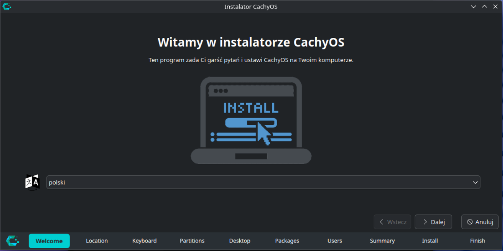

## Krok 4: Wybór strefy czasowej, języka systemu oraz formatu liczb i daty
W kolejnym oknie wybierz odpowiednią strerę czasową, język systemu oraz format liczb i daty. Domyślne wartości to:
- region: **Europe**
- strefa: **Warsaw**
- język systemu: **Polski (Polska)**
- format liczb i daty: **Polski (Polska)**

Możesz to zmienić w tym momencie wybierając region i strefę **z rozwijanych list** lub język systemu lub format liczb i daty klikając na przycisk **Zmień...**
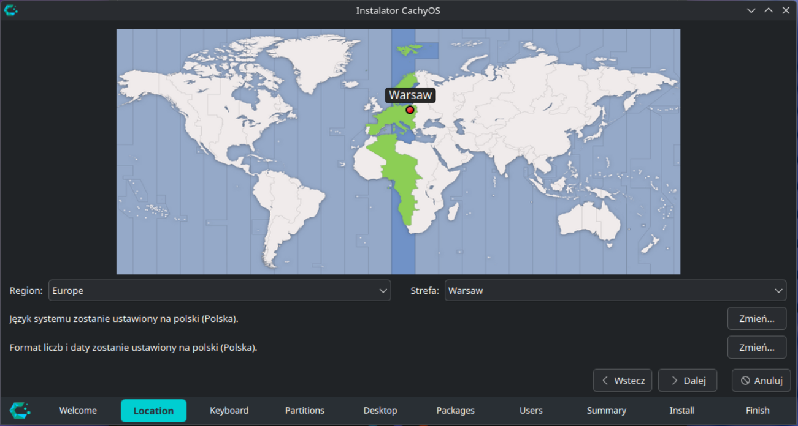

## Krok 5: Wybór układu klawiatury
Tutaj możesz wybrać posiadany model klawiatury (jeśli jest inny od standardowego typu 105 klawiszy) (1), język i układ klawiatury (2). Domyślne wartości to:
- model: **Generic 105-key PC**
- język klawiatury: **Polish**
- układ klawiatury: **Default**

Wybrane opcje możesz przetestować w polu tekstowym. (3)
Możesz również wybrać skrót klawiszowy do przełączania klawiatur z listy rozwijanej. (4)
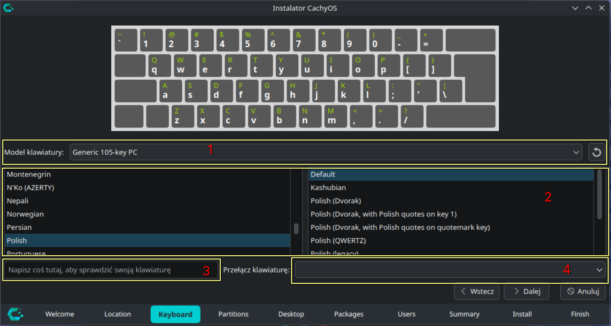

## Krok 6: Partycjonowanie dysku
To jest najtrudniejsza część instalacji systemu. Tu musisz zdecydować na którym dysku twardym zostanie zainstalowana dystrybucja (1).
Dostępne opcje do wyboru (2) to:
- **Wyczyść dysk** - ta opcja usuwa wszystkie dane z dysku - jeśli masz zainstalowanego na tym dysku Windowsa lub inną dystrybucję Linuksa utracisz system oraz dane bezpowrotnie
- **Instalacja obok obecnego systemu operacyjnego** (niewidoczna na screenie) - wybierasz ilość miejsca, jaką chcesz poświęcić do instalacji systemu
- **Ręczne partycjonowanie** - dla zaawansowanych użytkowników

Na potrzeby instruktarzu wybrano opcję najprostszą - Wyczyść dysk. A następnie po jej wybraniu należy wskazać system plików, jaki zostanie zastosowany w systemie (3). Domyślnym wyborem jest btrfs. Jeśli masz obawy, co do wyboru tego systemu plików możesz wybrać inny - ext4.

Możesz również zaszyfrować system (4), aczkolwiek - jeśli nie wiesz, co robisz nie dotykaj tej opcji. ;)
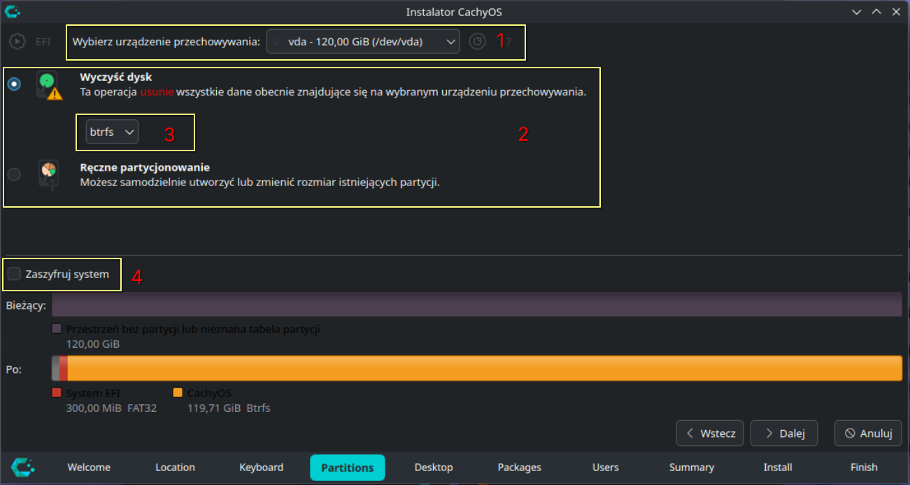

## Krok 7: Wybór środowiska graficznego
**Ten krok nie pojawia się w innych dystrybucjach Linuksa lub może wyglądać inaczej.** 

Niewątpliwą zaletą dystrybucji Linux jest możliwość dostosowania wyglądu do swoich preferencji. Do tego celu służą różnego rodzaju **środowiska graficzne** (DE - ang. Desktop Environment) oraz **menedżery okien** (WM - ang. Window Manager). CachyOS oferuje 17 takich opcji do wyboru. Jednak - na początek przygody - sugeruje się wybranie jednej z dwóch najbardziej popularnych - **KDE Plasma** (na screenie Plasma Desktop) lub **GNOME**.
Te dwa środowiska graficzne są najbardziej dopracowane.

Na cel tego instruktarzu oraz by zachować klimat znany z Windowsa (zwłaszcza dla początkujacych użytkowników przesiadających się z niego) wybrany został pulpit KDE Plasma (Plasma Desktop) zaznaczony domyślnie.
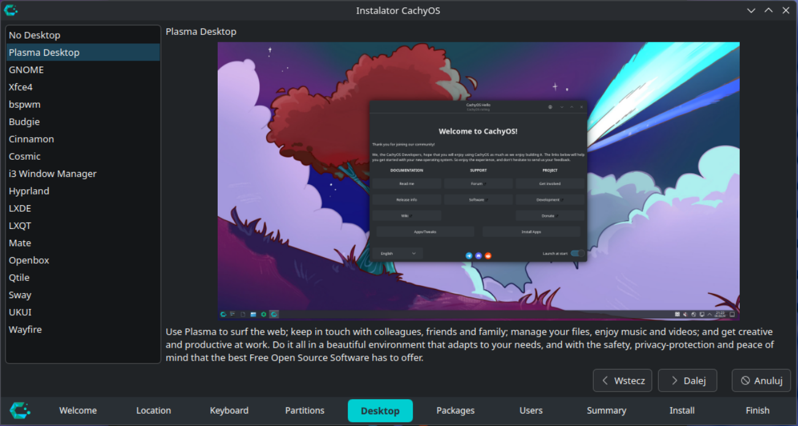

## Krok 8: Wybór komponentów systemu operacyjnego
**Ten krok dotyczy systemu CachyOS lub innych, jeśli instalator pozwala na dostosowywanie poszczególnych składników systemu.** 

**Jeśli jesteś początkującym użytkownikiem - zaleca się pozostawienie domyślnych ustawień.** 

W tym kroku możesz wybrać poszczególne składniki systemu CachyOS do swoich potrzeb.
Krótkie opisy poszczególnych sekcji znajdziesz ponizej:
- **CachyOS Packages** - są to aplikacje, które są przydatne w systemie CachyOS
- **CachyOS shell configuration** - tutaj znajdują się ustawienia dla powłók fish oraz zsh (jeśli chcesz skonfigurować "po swojemu" można odznaczyć)
- **Base-devel + Common packages** - tu są podstawowe elementy systemu - nie dotykaj, jeśli nie wiesz co robisz
- **kolejne boxy do zaznaczenia dotyczą poszczególnych środowisk graficznych** - uwaga! musi być zaznaczony TYLKO jeden box!
- **CPU specific Microcode update packages** - mikrokody dla procesorów AMD oraz Intel, zostaw zaznaczone
- **Firefox and language package** - przeglądarka Firefox oraz pliki językowe
- **Printing Support** - obsługa drukarek - zaznacz, jeśli masz drukarkę
- **Support for HP Printer/Scanner** - wsparcie dla drukarek i skanerów HP
- **Accessibility Tools** - dodatkowe aplikacje lub ustawienia dla osób z niepełnosprawnościami

Na potrzeby tego poradnika - zostawiłem domyślne opcje z zaznaczeniem obsługi drukarek.

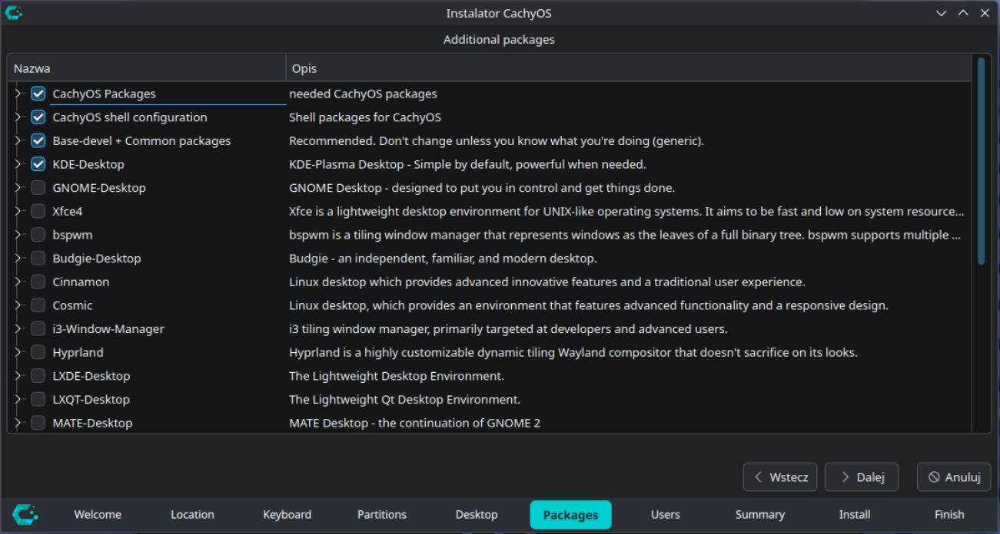

## Krok 9: Ustawienia użytkownika systemu
W tym kroku podajesz "pełną nazwę użytownika" - na przyklad imię, nazwę użytkownika, nazwę komputera (hostname) oraz hasło do użytkownika.
Możesz też zaznaczyć, czy użytkownik ma się logować do systemu bez podawania hasła oraz możesz wybrać, czy hasło użytkownika jest hasłem administratora. Jeśli nie chcesz, by tak było, odznacz tę opcję i wpisz inne hasło dwukrotnie w kolejnych polach tekstowych. 

**Ważne! Użytkownik systemu musi posiadać skonfigurowane hasło!**

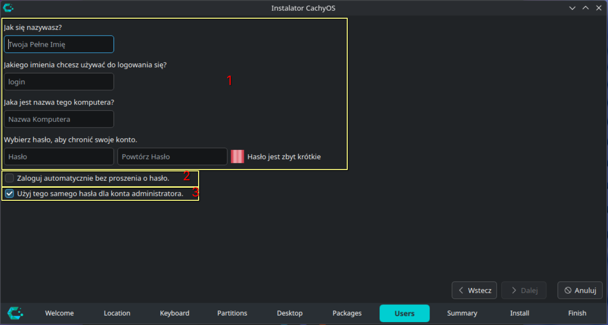

## Krok 10: Podsumowanie przed rozpoczęciem instalacji
To już ostatni etap przed rozpoczęciem kopiowania plików na dysk. To też ostatnia szansa na poprawki! Upewnij się, czy wszystkie dokonane wybory są prawiłowe i jeśli tak - rozpocznij instalację przez wybranie przycisku **Zainstaluj**.

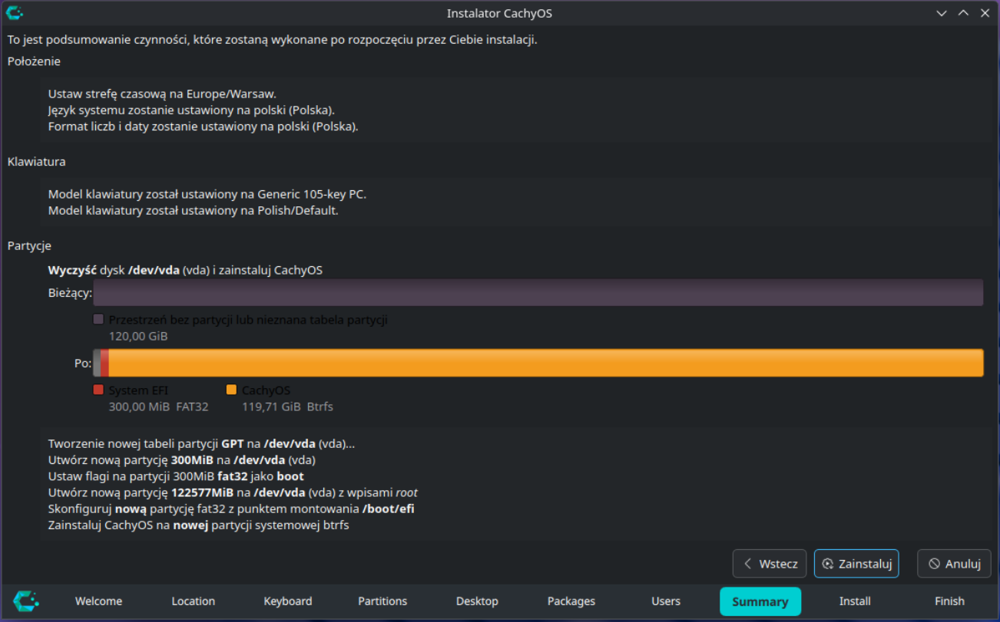

Następnie potwierdź swój zamiar instalacji.

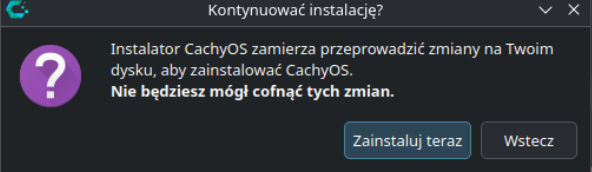

## Krok 11: Instalacja systemu
Teraz możesz zrobić sobie kawę, herbatę, jedzenie, cokolwiek innego. W tym czasie instalator dokona zmian na dysku, zainstaluje wybrane pakiety i skonfiguruje system do działania. To moze potrwać w zależności od posiadanego sprzętu i łącza internetowego od 10 do 60 minut.

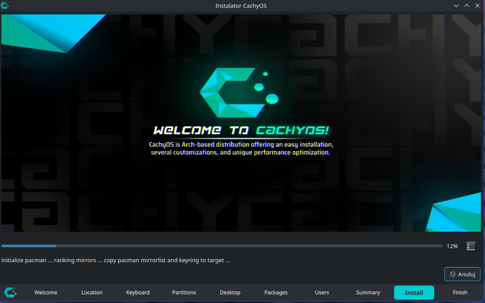

## Krok 12: Zakończenie instalacji systemu
Udało się! Dystrybucja Linuksa właśnie została zainstalowana! Możesz zakończyć działanie instalatora.
Jeśli chciałbyś, aby instalator od razu uruchomił komputer ponownie, zaznacz opcję **Uruchom ponownie teraz**.

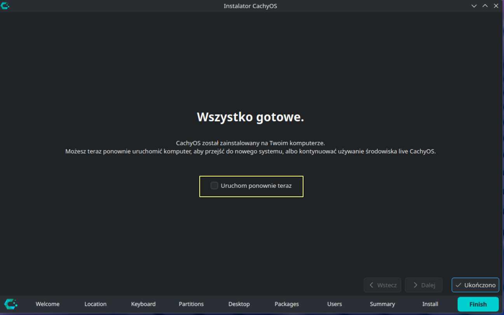

Po uruchomieniu ponownym komputera wyciągnij pendrive z instalatorem.

Jeśli wszystko powiodło się pomyślnie po uruchomieniu komputera powinien pojawić się bootloader systemu. Na screenie poniżej ukazany jest Grub.

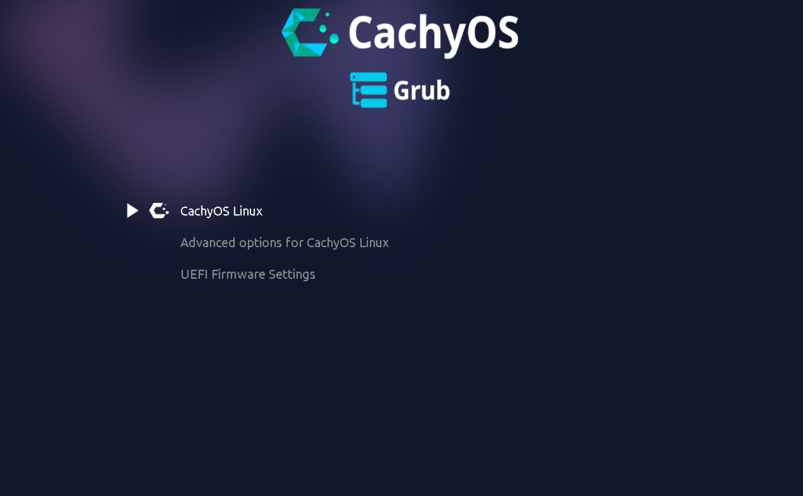

Po wybraniu opcji CachyOS system uruchomi się i pojawi się okno logowania (o ile w instalatorze nie zaznaczyłeś opcji automatycznego logowania).

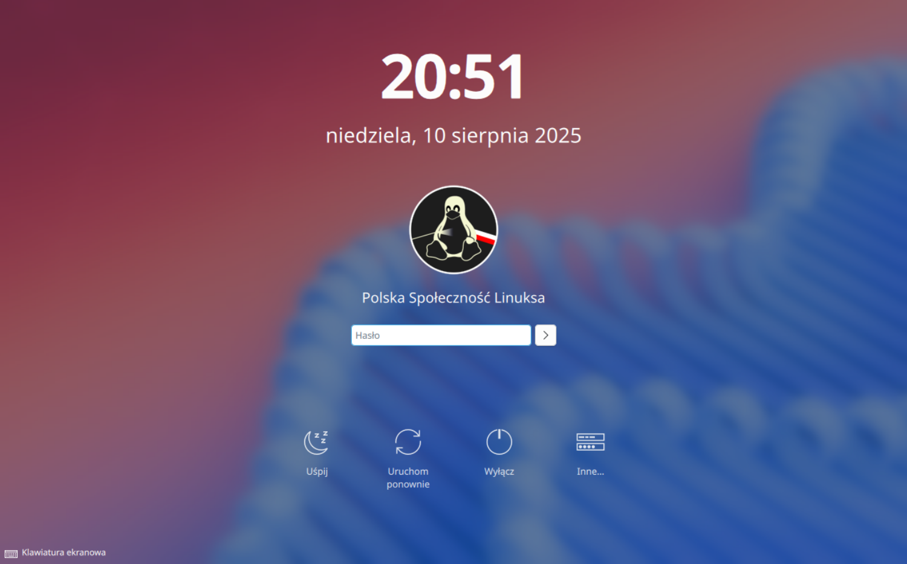